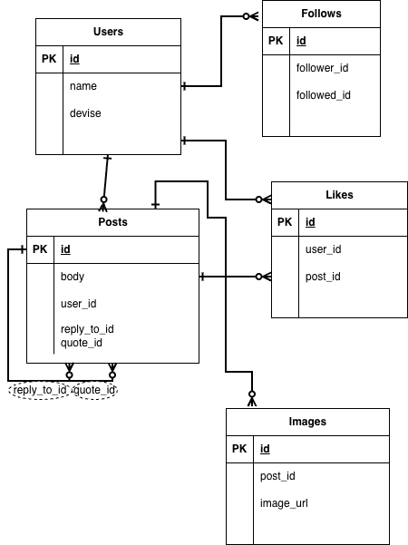

# mini_twitter

## 概要　

Twitter風のSNSアプリケーションです。
手軽に自身の考えを発信したい人向けのものです。

## 機能一覧

- ユーザー登録・ログイン
- テキスト投稿
- リプライ・引用投稿
- いいね（いいね / いいね取り消し）
- フォロー / フォロー解除
- タイムライン（フォロー中のユーザーの投稿を表示）

## ER図

## 技術スタック

- Ruby on Rails 7.2.3

- PostgreSQL 16.11

- devise 5.0.2

- RSpec　8.0.3

## 技術選定理由

### Ruby on Rails

楽しさを重視したプログラミング言語Rubyを使ったアプリ開発をするため採用。
RESTfulな設計思想により、SNSのようなWebアプリケーションを迅速に開発するのに適している。

### PostgreSQL

実務環境で多く使われているDBであるため

### devise 5.0.2

実務で最も採用率が高く、現場で求められる知識だから

### RSpec　8.0.3

Web系の現場で最も広く使われているため、実務を意識して選択

## 開発中に意識したこと

- 今書いているコードが全体のフローの中でどのような動きをするか意識していた
- なるべくなぜこう動くのかを理解しながら進むようにしていた
- フォロー機能では自己結合リレーションを用い、同じUsersテーブルへの2つの外部キーでフォロー/フォロワーの双方向の関係を実現した
